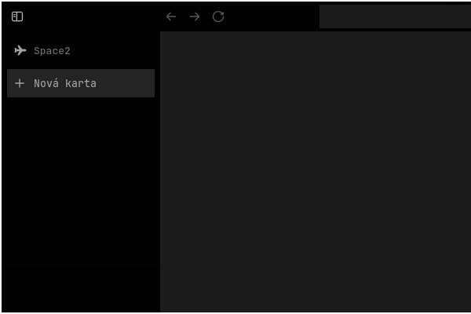

# Squares

Simple [Zen Browser](https://zen-browser.app/) Mod that "Squares" all rounded corners.

## Features
Removes rounded corners from the browser UI
Applies to tabs, panels, buttons, menus, and other UI elements

    
        <h1>
    
## Compatibility
Zen Browser 1.21.x and newer.

## License

MIT
